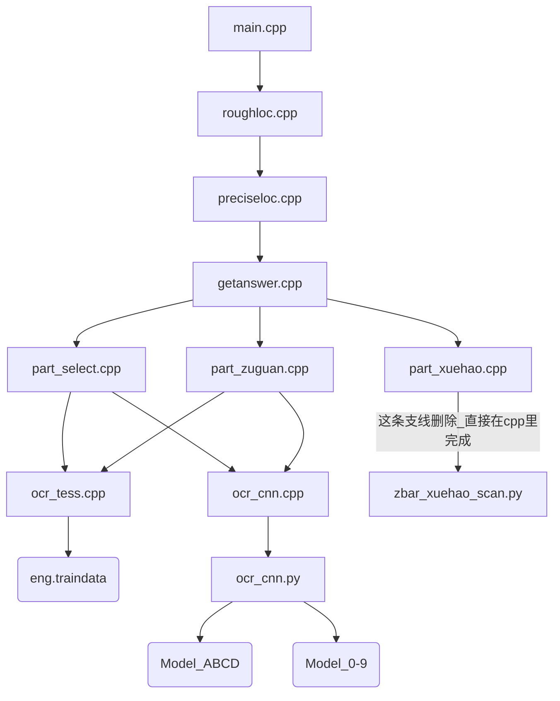

# 进展说明

## 目录结构

- parts				//学号，选择，解答模块识别部分
  - models		        //识别模型
    - cnn
    - tess
  - part_xxx.cpp            //分模块实现程序 
- samples                        //样本
- xxxx.cpp                      //主题实现程序
- xxxx.h

### 调用层次



### 依赖库说明

- tesseract

  > 对数字和字符提供辅助识别方法

- zbar

  > 学号二维码识别

- opencv

  > 图像处理，答题域位置定位、分割和保存

- jsoncpp

  > 整个试卷的结果以指定的json格式输出

- python

  > tensorflow的运行环境，cpp调用的python的库支持

- tensorflow

  > 数字和识别的主体cnn识别方法

## 事件记录

- 2016年12月14日

  > 注意在文件加入vs工程的时候将将文件的格式进行转换，不然会提示很多莫名其妙的


- 2016年12月24日

  > 完成整个框架的梳理，处于联合调试阶段
  >
  > > 1, 将二维码的识别利用opencv+zbar完成，不再调用python模块
  > >
  > > 2, 调整流程，若学号识别部分出错，则整个程序退出
  >
  > 待做
  >
  > > 1, 重新训练模型，用二值化的01的图像做训练，得到新模型
  > >
  > > 2, cnn和tess的结果进行整合，给出最优的结果

- 2016年12月25日

  > 再次梳理框架，对用作二次训练的结果的保存进行了优化，避免覆盖，处于联合调试阶段
  >
  > 待做
  >
  > > 1，训练图像细化，二值化（01），模型的重修训练（整体都需要细化？）

- 2016年12月31日

  > 问题：
  >
  > Exception TypeError: 'function takes at least one argument' in <module 'threading' from '/usr/lib64/python2.7/threading.pyc'> ignored
  >
  > 解决办法：[参考](https://bitbucket.org/anthony_tuininga/cx_freeze/issues/97/attributeerror-module-object-has-no)
  >
  > ```python
  > # 在文件开始添加
  > if not hasattr(sys, 'argv'):
  >     sys.argv  = ['']
  > ```
  >
  > 待做：
  >
  > > 能不能将tensorflow的调用部分也用c++完成，不再调用python模块，完成一统

- 2017年1月8日

  > 问题：
  >
  > 每次主观题识别的时候都重复调用cnn模型，这个过程导致崩溃

- 2017年5月23日

  > 问题：
  >
  > 决定重启深度学习的项目，在大方向上做出突破的进展

## 资料参考

[极客学院Tensorflow教程](http://wiki.jikexueyuan.com/project/tensorflow-zh/get_started/basic_usage.html)