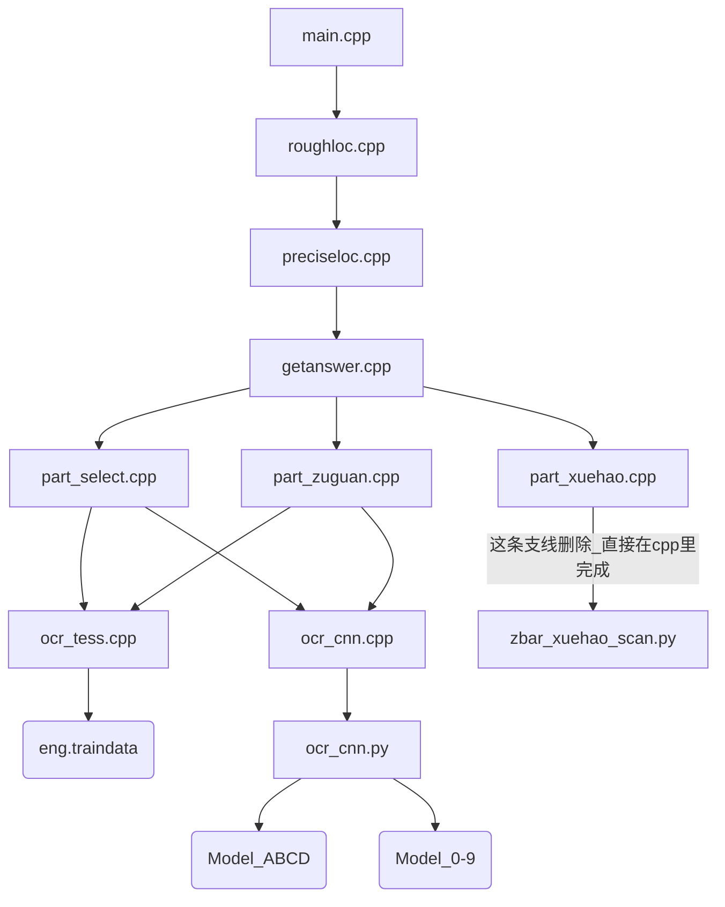

# 进展说明

## 目录结构

- parts				//学号，选择，解答模块识别部分
  - models		        //识别模型
    - cnn
    - tess
  - part_xxx.cpp            //分模块实现程序 
- samples                        //样本
- xxxx.cpp                      //主题实现程序
- xxxx.h

### 调用层次

## 事件记录

- 2016年12月14日

  > 注意在文件加入vs工程的时候将将文件的格式进行转换，不然会提示很多莫名其妙的

- 2016年12月24日

  > 完成整个框架的梳理，处于联合调试阶段
  >
  > > 1, 将二维码的识别利用opencv+zbar完成，不再调用python模块
  > >
  > > 2, 调整流程，若学号识别部分出错，则整个程序退出
  >
  > 待做
  >
  > > 1, 重新训练模型，用二值化的01的图像做训练，得到新模型
  > >
  > > 2, cnn和tess的结果进行整合，给出最优的结果

  ​