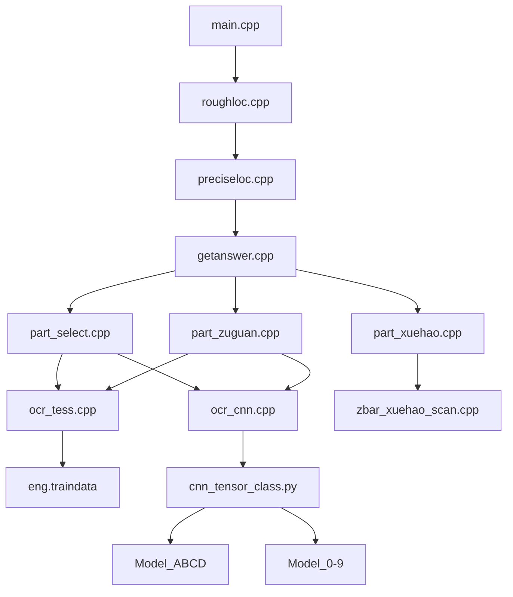

# 进展说明

## 目录结构

- parts			//学号，选择，解答模块识别部分
  - models		//识别模型
    - cnn
    - tess          
- samples               //样本

### 调用层次

## 事件记录

- 2016年12月14日

  > 注意在文件加入vs工程的时候将将文件的格式进行转换，不然会提示很多莫名其妙的错误
  >
  > ​
